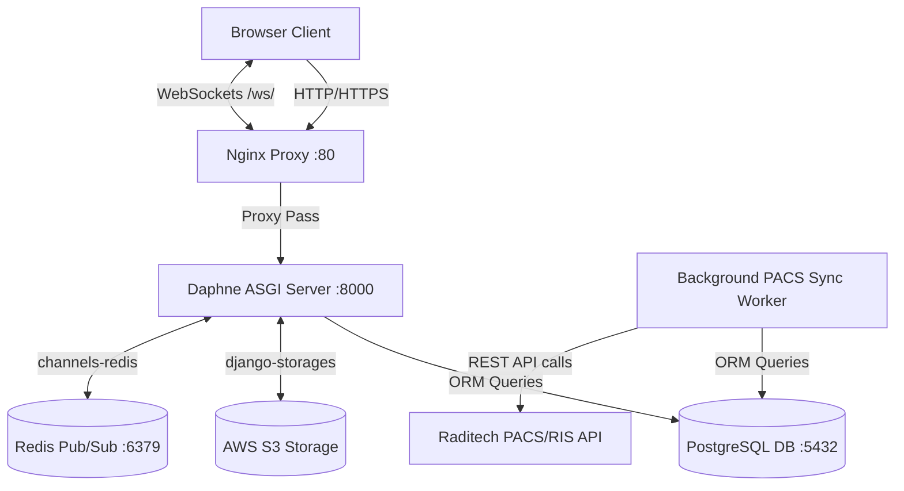

# RadiographXpress: Architecture Overview 🏗️

This document provides a high-level overview of the RadiographXpress system architecture. It is designed for new developers onboarding onto the project.

## Core Technology Stack

RadiographXpress is built on a modern Python web stack designed for concurrent performance and real-time updates.

*   **Framework:** Django 6.0.1 (Python 3.13+)
*   **Asynchronous Server (ASGI):** Daphne 4.2.1
*   **WebSockets:** Django Channels 4.3.2
*   **Database:** PostgreSQL 16 (Production) / SQLite3 (Local Dev)
*   **In-Memory Store / Broker:** Redis 7 (Production)
*   **Reverse Proxy / Web Server:** Nginx (Alpine)
*   **PDF Generation:** WeasyPrint 68.0

## System Architecture Diagram

## Application Structure

The Django project is modularized into several apps based on user roles and core functionality:

1.  **`radiographxpress` (Config):** Contains the main `settings.py`, `urls.py`, and the `asgi.py` / `wsgi.py` routing configurations.
2.  **`core`:** The heart of the application. Contains the main data models (`Study`, `Report`, `StudyRequest`), the `sync_pacs_images` management command, WebSocket consumers (`consumers.py`), and the WeasyPrint PDF generation logic.
3.  **`patientsDashboard`:** Views, models, and templates specific to the patient experience (viewing studies, granting doctor access).
4.  **`doctorsDashboard`:** The workspace for **Reporting Doctors (Radiologists)**. Contains the interface for locking studies and writing diagnostic reports.
5.  **`associateDoctorDashboard`:** The interface for **Associate Doctors (Referring Physicians)**. Allows them to view studies for patients who have explicitly granted them access.
6.  **`assistantDashboard`:** Administrative interface for front-desk staff to create patients and verify associate doctor registrations.

## Deployment Strategy

The application is fully containerized using Docker and Docker Compose. 

*   **Multi-stage builds:** The `Dockerfile` handles heavy system dependencies like `libpango` and `libcairo` required by WeasyPrint, while keeping the final image lightweight.
*   **Environment Parity:** The same codebase runs locally (falling back to SQLite and InMemory channels) or in production (using PostgreSQL and Redis) purely based on the presence of Environment Variables (`DATABASE_URL`, `REDIS_URL`).
*   **Static Files:** Served efficiently by Nginx via a shared Docker volume, with WhiteNoise acting as a fallback within Django.

## Security Considerations

*   **Authentication:** Standard Django Session authentication.
*   **Authorization:** Handled via Django `Groups`. Custom decorators (`@user_passes_test`) ensure views are protected.
*   **Data Isolation:** Associate Doctors can *only* see patients who have explicitly linked their accounts via the `AssociatedDoctor` ManyToMany field on the `Patient` model. Patients can revoke this at any time.
*   **SQL Injection Prevention:** All queries use the Django ORM. Raw queries were refactored out. API Views validate numeric IDs (`try: int(pk)`) before passing them to the ORM to prevent `ValueError` crashes or injection attempts.
