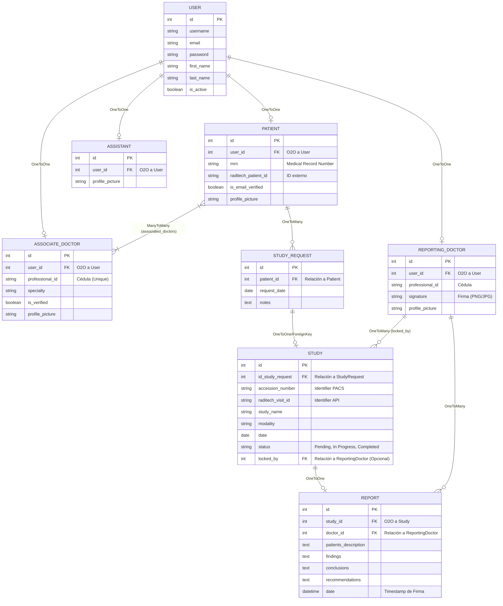

# Diagrama de Entidad-Relación (ERD)

A continuación se presenta el diagrama detallado de la base de datos de RadiographXpress. El sistema utiliza el ORM de Django, apoyándose fuertemente en relaciones "One-to-One" con el modelo estándar de Autenticación (`auth.User`) para manejar los perfiles y roles.

## Detalles de las Relaciones Críticas

*   **Confidencialidad:** La relación *Many-To-Many* (`associated_doctors`) entre `Patient` y `AssociateDoctor` es la que determina qué médicos externos pueden visualizar los expedientes clínicos de qué pacientes. Si no existe un registro en esta tabla pivote, el acceso es denegado (`HTTP 403`).
*   **Bloqueos Conexos (Locks):** La llave foránea `locked_by` en la tabla `Study` apunta al radiólogo (`ReportingDoctor`) que está dictaminando el estudio actualmente. Cuando este valor no es nulo y el estado es `In Progress`, la UI inhabilita el estudio para el resto del hospital.
*   **Sincronización Múltiple:** El `StudyRequest` nace manualmente por el Asistente, mientras que el `Study` se genera asíncronamente vía el PACS (Sincronizador Raditech). Ambos se correlacionan a través de la llave foránea `id_study_request`.
